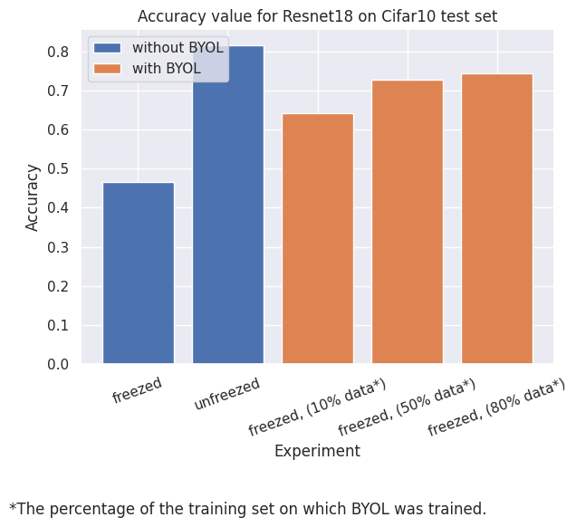

# BYOL From Scratch

Bootstrap Your Own Latent (BYOL) model written from scratch with Pytorch, based on publication [[BYOL paper](https://dl.acm.org/doi/pdf/10.5555/3495724.3497510)].


## Example usage
```python
from torch import optim
from torchvision.models import resnet18

from byol_from_scratch.model import BYOL
from byol_from_scratch.train import train_byol

device = 'cuda' # or 'cpu'

resnet18_model = resnet18(pretrained=True)
byol_model = BYOL(
    base_model=resnet18_model, 
    image_size=32, 
    projection_hidden_size=4096, 
    projection_size=256, 
    moving_avg_decay=0.99
)
optimizer = optim.Adam(byol_model.parameters(), lr=1e-4)
train_dl = # training, Pytorch dataloader

byol_model = train_byol(
    model=byol_model,
    train_dl=train_dl,
    optimizer=optimizer,
    epochs=100,
    device=device
)
# now byol_model can be used as a encoder for features extraction
```

## Experiments


In the given plot, "freezed" means that the model during training on the Cifar10 dataset had frozen encoder weights - Resnet18 and only its classification head was trained. Unfreezed means that the entire Resnet18 model has been trained.

Above experiment is in _experiments/experiment.ipynb_ notebook.

### Citations
```
@inproceedings{10.5555/3495724.3497510,
author = {Grill, Jean-Bastien and Strub, Florian and Altch\'{e}, Florent and Tallec, Corentin and Richemond, Pierre H. and Buchatskaya, Elena and Doersch, Carl and Pires, Bernardo Avila and Guo, Zhaohan Daniel and Azar, Mohammad Gheshlaghi and Piot, Bilal and Kavukcuoglu, Koray and Munos, R\'{e}mi and Valko, Michal},
title = {Bootstrap your own latent a new approach to self-supervised learning},
year = {2020},
isbn = {9781713829546},
publisher = {Curran Associates Inc.},
address = {Red Hook, NY, USA},
booktitle = {Proceedings of the 34th International Conference on Neural Information Processing Systems},
articleno = {1786},
numpages = {14},
series = {NIPS '20}
}
```